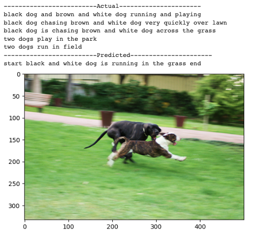
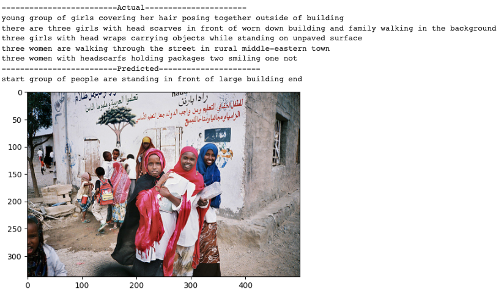

# Image-Caption-Generator

## Table of contents
- [Table of contents](#table-of-contents)
- [Mission Statement](#mission-statement)
- [Summary of Problem](#summary-of-problem)
- [Dataset](#dataset)
- [Methods Used](#methods-used)
- [Technologies and Softwares](#technologies-and-softwares)
- [Required Packages](#required-packages)
- [Results](#results)
- [Authors](#authors)

## Mission Statement

The core objective of this project is to develop an image caption generator. This software will prove invaluable for individuals with visual impairments, empowering them to generate accurate and descriptive captions for images they cannot see. At the heart of the mission is the commitment to inclusivity and accessibility. It’s important to recognize the challenges faced by individuals with visual impairments in understanding and interacting with the visual world. The software aims to bridge this gap, providing a means for the visually impaired to access and comprehend visual content with the aid of descriptive captions.

 

## Summary of Problem:  

The problem at hand revolves around the accessibility and comprehension of visual content for individuals with visual impairments. The lack of vision creates a significant barrier for such individuals to interact with images, photographs, and illustrations, limiting their ability to understand and participate in the visually-driven world.

To address this challenge, the project aims to develop an advanced image caption generator that leverages artificial intelligence and machine learning. The software's primary goal is to generate descriptive and contextually relevant captions for images, enabling visually impaired users to gain a deeper understanding of visual content they cannot directly perceive.

## Dataset:

Dataset is taken from Kaggle: https://www.kaggle.com/datasets/adityajn105/flickr8k
A new benchmark collection for sentence-based image description and search, consisting of 8,000 images that are each paired with five different captions which provide clear descriptions of the salient entities and events. … The images were chosen from six different Flickr groups, and tend not to contain any well-known people or locations, but were manually selected to depict a variety of scenes and situations.

## Methods Used
[(Back to top)](#table-of-contents)
-	Dataset Downloading:
       -	The Kaggle API was utilized to download the dataset from Kaggle, which comprised multiple captions for each image. All five captions were used to train the neural network, posing the challenge of cleaning these captions.
         
-	Captions underwent various preprocessing steps:
       -	Removal of stopwords.
       -	Removal of punctuation.
-	Elimination of unnecessary spaces.
       -	Addition of start and end tokens, crucial for training the model using Neural Network.
       -	Utilization of Count Vectorizer to convert text data into numerical format.
       -	Tokenization for converting text sequences into sequences of integers.
-	Transfer Learning:
       -	To expedite the training process, the VGG16 pre-trained model was employed. VGG16 is known for its efficacy in image classification tasks and allowed the extraction of image features.
-	LSTM Model Training:
       -	Subsequently, the LSTM (Long Short-Term Memory) model was employed to train the network. LSTM is adept at capturing long-term dependencies in sequential data, making it suitable for generating textual captions.
-	Dual Input for Neural Network:
       -	The Neural Network received two types of inputs:
                -	Image Input: Image features were extracted from the VGG16 model.
                -	Text Input: An embedding layer with LSTM was utilized to capture the long-term context of words within the captions.
-	Merge and Caption Generation:
       -	The extracted image features and text embeddings were merged in the neural network, culminating in a Dense layer responsible for generating the caption corresponding to the input image.

## Technologies and Softwares
[(Back to top)](#table-of-contents)
-	Programming Languages: Python
-	Computer Vision Libraries: OpenCV
-	Deep Learning Frameworks: TensorFlow, Keras
-	Natural Language Processing (NLP) Libraries: NLTK (Natural Language Toolkit), TextBlob
-	Image Processing and Visualization: Matplotlib, PIL (Python Imaging Library)
-	Pre-trained Models: VGG16
-	Text Preprocessing: Regular Expressions (re), String Operations

## Required Packages
[(Back to top)](#table-of-contents)

-	cv2 (OpenCV) - Used for computer vision tasks.
-	random - Used for generating random numbers and choices.
-	numpy - Used for numerical computations with arrays.
-	matplotlib - Used for data visualization.
-	pandas - Used for data manipulation and analysis.
-	html - Used for HTML-related operations.
-	contractions - Used for text preprocessing, expanding contractions.
-	sklearn.feature_extraction.text.CountVectorizer - Used for converting text data into numerical format.
-	tensorflow - Deep learning library for building and training models.
-	tensorflow.keras.preprocessing.text.Tokenizer - Used for text tokenization.
-	tensorflow.keras.preprocessing.sequence.pad_sequences - Used for padding sequences to a fixed length.
-	keras.applications.vgg16.VGG16 - Pre-trained VGG16 model for image processing.
-	tensorflow.keras.utils - Utility functions for TensorFlow models.
-	pickle - Used for object serialization.
-	tensorflow.keras.layers - Contains various layers for building neural networks.
-	re - Used for regular expressions and text pattern matching.
-	string - Used for string manipulation.
-	wordcloud - Used for creating word clouds from text data.
-	nltk - Natural Language Toolkit for NLP tasks.
-	textblob - Used for text processing and sentiment analysis.

## Results
[(Back to top)](#table-of-contents)
Let's look at the images where the model is performing well. 

<B>Now, let's take a look at images where the prediction is absurd.  </B>

## Authors
[(Back to top)](#table-of-contents)

- [@Akanksha Sharma](https://github.com/akankshasharmadid)
    
    

